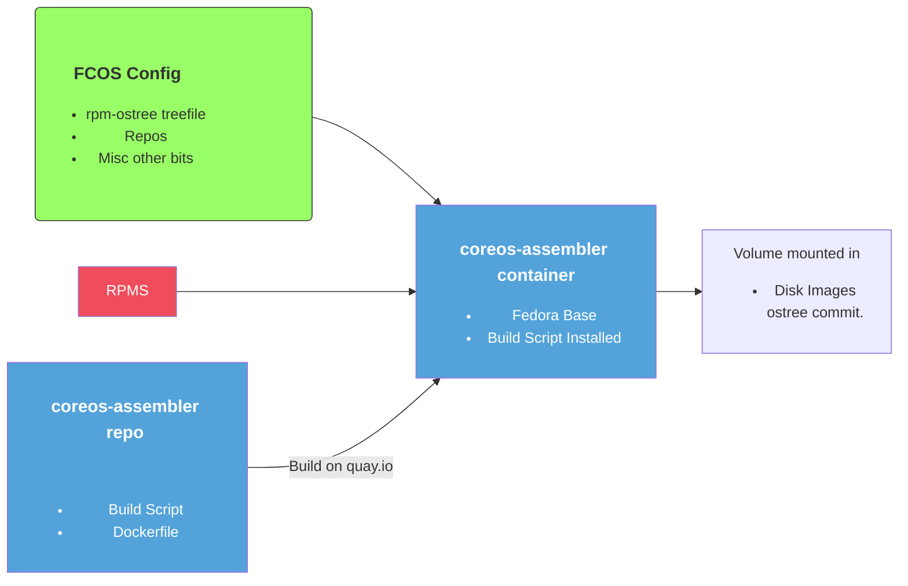

# Guide to update the build process SVG

<!-- The path to this SVG is fixed here to make sure that it is correctly
displayed both on the coreos.github.io website rendered by Jekyll and on
github.com while browsing the repository view. The main downside here is that
this will not be updated for branches -->

- Go to [mermaid-live-editor](https://mermaidjs.github.io/mermaid-live-editor)
- Copy paste script:

- Export to Svg and update `build-process.svg`
